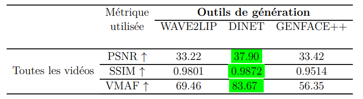
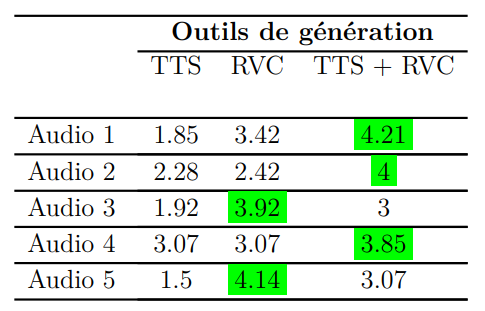
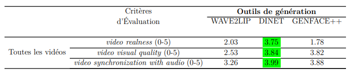
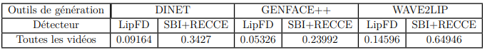

# Realistic Deepfake  Generation Techniques 

This repository presents a comprehensive study and implementation of advanced **deepfake generation techniques**, combining **audio deepfake tools** (**XTTS** and **RVC**) with **video deepfake tools** (**GeneFace**, **Wave2Lip**, and **DINet**). The objective is to create highly realistic deepfake videos that are difficult to detect, showcase generated outputs, and evaluate their performance using both **quantitative metrics** and **subjective evaluations**.

---

## Table of Contents

1. [Overview](#overview)
2. [Audio Deepfake Generation Techniques](#audio-deepfake-generation-techniques)
   - [XTTS](#xtts)
   - [RVC](#rvc)
   - [XTTS + RVC](#xtts--rvc)
3. [Video Deepfake Generation Techniques](#video-deepfake-generation-techniques)
   - [GeneFace](#geneface)
   - [Wave2Lip](#wave2lip)
   - [DINet](#dinet)
4. [Results](#results)
   - [Audio Results](#audio-results)
   - [Video Results](#video-results)
   - [Evaluation Scores](#evaluation-scores)
5. [Evaluation](#evaluation)
   - [Objective Evaluation](#Quantitative-evaluation)
   - [Subjective Evaluation](#subjective-evaluation)
6. [Conclusion](#Conclusion)

---

## Overview

Deepfake technology leverages **Generative AI** to create synthetic media that mimics real-world visuals and sounds. This project implements a pipeline combining **audio deepfake generation** with **video synthesis** to produce highly realistic videos. 
after a study of the state of art we found that the most effective way to make realistic deepfake is LipSync so we eliminate faceswap and animation tools.
The techniques utilized include state-of-the-art tools for **audio synthesis** and **lip-syncing**, enabling seamless alignment of generated audio with facial movements.

### Key Objectives:
- Explore and compare multiple **deepfake generation tools**.
- Combine audio and video tools to generate seamless deepfake videos.
- Evaluate the performance of these techniques using:
  - **Objective metrics** (quantitative evaluations).
  - **Subjective metrics** (user feedback and detector robustness).

---

## Audio Deepfake Generation Techniques

### XTTS
**XTTS**  is an end-to-end TTS system that utilizes a [VQ-VAE](https://arxiv.org/abs/1711.00937#) model  to discretize audio into tokens, which are then predicted by a GPT model based on the input text and speaker latent vectors. The output of the GPT model is passed to a decoding model to generate the audio signal.

[XTTS model Link](https://huggingface.co/coqui/XTTS-v2)

### RVC
**RVC** (Retrieval-based Voice Conversion) is a powerful open-source voice-to-voice conversion tool. Unlike traditional programs that rely on training, RVC operates by replacing input source characteristics with those from a training dataset using a top-1 retrieval approach.

[RVC Repository Link](https://github.com/RVC-Project/Retrieval-based-Voice-Conversion-WebUI/tree/main)

### XTTS + RVC
The combination of **XTTS** and **RVC** enhances the realism and personalization of generated audio, aligning perfectly with the video synthesis.

---

## Video Deepfake Generation Techniques

### GeneFace++
**GeneFace++** is a talking face generation system based on Neural Radiance Fields (NeRF). Compared to GAN-based techniques, NeRF generators preserve more details and provide better 3D realism, modeling a continuous 3D scene in the latent space.

[GeneFace++ Repository Link](https://github.com/yerfor/GeneFacePlusPlus)

### Wave2Lip
**Wave2Lip** is a lip-sync generation method that uses a 2D-based GAN approach. Although this method may yield lower-quality results compared to others, it enables the model to generalize effectively across different individuals.

[Wave2Lip Repository Link](https://github.com/Rudrabha/Wav2Lip)

### DINet
**DINet** is a lip-sync generation method that also uses GANs to enhance the realism of deepfake videos by improving lip synchronization and facial dynamics.

[DINet Repository Link](https://github.com/MRzzm/DINet)

---
### Original Videos 

we selected diffrant famous people to generate deepfake hers some sample of them

**video 1 (French): Kyliane Mbappé**

https://github.com/user-attachments/assets/52bfad60-88dd-4581-9915-92b216893ab5

the script used to generate audios : 

"" Bonjour, c'est Kilyane Mbappé. Je vous annonce que finalement, 
j'ai décidé de quitter l'équipe de France pour rejoindre l'équipe nationale d'Algérie. 
J'ai décidé de représenter les Fennecs parce que c'est un choix du cœur. 
Et je suis toujours fier de porter le maillot des Verts. One, two, three, viva l'Algérie!  ""

**vidéo 2 (Arabic "Algerien dialect") : Présidant Tebboune** 

https://github.com/user-attachments/assets/2bbd2b33-6f34-42ce-bf50-1b4cdae48353

## Results

### Audio Results
Audio samples generated using **XTTS** and **RVC** for one subject are provided in the repository. These showcase the tools' ability to generate realistic and natural-sounding audio. Below are links to the generated audio outputs:

**XTTS-Generated Audio**     

https://github.com/user-attachments/assets/9c8e7d1a-e031-46f2-9c17-5d8aa657cee6

**RVC-Transformed Audio**       

https://github.com/user-attachments/assets/66e7286f-ea0c-412e-a3dd-9e7b7c8fd906

**XTTS + RVC Combined Audio**

https://github.com/user-attachments/assets/356e16ad-95d1-48e2-a697-37ed36a25a7a

### Video Results
The repository contains video samples created using **GeneFace**, **Wave2Lip**, and **DINet**. Below are results for the two previous subjects:

**Wave2Lip- Video of kylyane mbappé**

https://github.com/user-attachments/assets/bbfdeb3f-0533-4970-86a2-d9b3e9d53c99

**DINet Video of presdent tebounne**

https://github.com/user-attachments/assets/d3180b8c-5a44-43b4-bb51-4fa528c420e9

**GeneFace-Generated Video of kyliane mbappé**

https://github.com/user-attachments/assets/ae737765-dacb-4649-850c-7089017e6adf

To see more videos, click this link: [Video Results](https://drive.google.com/drive/u/4/folders/12Fh-KmeOdAszNoCKFOtl4_gU2pz8gsUu)

### Evaluation Scores

Quantitative and subjective evaluation results are presented below:

#### Quantitative Evaluation

In this evaluation, we use three metrics (PSNR, SSIM, and VMAF) to assess the performance of the three tools on five subjects . 

To conduct this analysis, we utilize **FFmetric**, an open-source software designed to compute these metrics.
[FFmetric Repository Link](https://github.com/fifonik/FFMetrics)

#### Subjective Evaluation

To complement the objective quality assessment, we conducted a subjective evaluation involving real users to assess the perceived quality of deepfake content. The evaluation consisted of the following steps:

**Video and Audio Preparation**: We used the same videos from the objective evaluation, keeping the individuals, audio recordings, and duration consistent.

**Recruitment of Evaluators**: Ten evaluators, familiar with the individuals in the videos, were selected to ensure relevant feedback.

**Evaluation Criteria**:
- Audio: Evaluators rated audio based on clarity, intelligibility, and emotional expression, scoring from 1 (poor) to 5 (excellent).
- Video: Evaluators rated video realism, quality, and lip-sync accuracy compared to real videos using the same 1-5 scale.

**Process**: Evaluators first rated audio clips. The top-rated audios were then used to generate lip-synced deepfake videos, which were subsequently rated based on video criteria. The final scores were averaged and used for comparison.

This subjective evaluation provided additional insights into the quality and realism of the deepfake content generated, alongside the objective metrics.

**Audio evaluation result :**

**Video evaluation result :**

To evaluate further, we performed a detector test using two open-source detectors to evaluate LipFD and SBI+RECCE (score <0.5 means videos didnt classified as a deepfake).

[LipFD Repository Link](https://github.com/AaronComo/LipFD)

[SBI Repository Link](https://github.com/mapooon/SelfBlendedImages)

[RECCE Repository Link](https://github.com/VISION-SJTU/RECCE)

According to the results obtained, DINET is the most effective tool for generating high-quality deepfake videos, offering the best combination of realism, visual quality, and lip synchronization. GENFACE++ shows variable performance but excels in terms of perceived authenticity. WAVE2LIP is competitive but generally falls behind DINET and GENFACE++ in terms of video quality and perceived authenticity. These evaluations provide an overview of the strengths and limitations of each tool, highlighting their key advantages and areas for improvement.

## Conclusion and futur work

In summary, this study makes a contribution to mastering and understanding the various methods and tools for generating audio and video deepfakes. It successfully generates realistic audio deepfakes in multiple languages by combining different audio generation methods (TTS + RVC) and trains voice conversion models to replicate voices of individuals speaking Arabic (Darija), such as Hafid Derradji and President Tebboune. Additionally, it conducts a comprehensive evaluation (both subjective and objective) of the various generated deepfakes.

for futur work :

1. Designing a workflow (pipeline) that automates the end-to-end deepfake generation process, transforming an original video with an input text into a realistic deepfake video.
2. Enhancing the neural network architectures of various generation techniques to improve the quality and realism of deepfakes.

